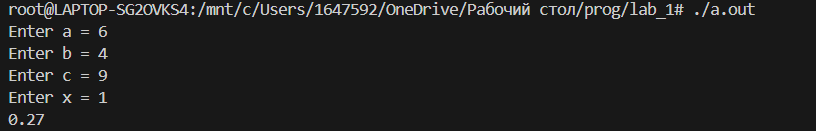
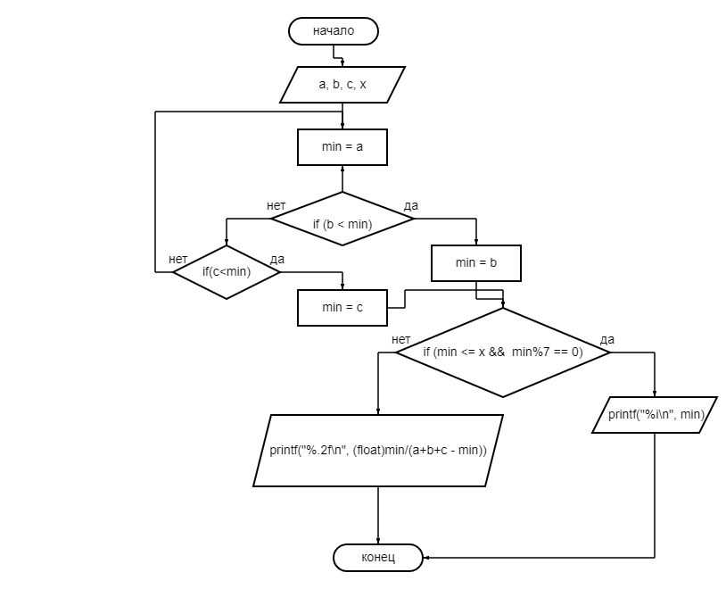

# Лабораторная работа №1
## Вариант 3
## Задание 
1. **Разобрать код программы из примера** 
2. **Составить блок схему алгоритма**
3. ***Напишите программу, решающую задачу по своему варианту*** : ```Вывести значение наименьшего из трёх параметров a, b, c если оно меньше или равно x и кратно 7, и частное наименьшего параметра и суммы двух оставшихся иначе.```
4. **Оформить отчёт в README.md**
## Код
``` #include <stdio.h>

int main() {
    int a, b, c, x;
    printf("Enter a = "); scanf("%i", &a);
    printf("Enter b = "); scanf("%i", &b);
    printf("Enter c = "); scanf("%i", &c);
    printf("Enter x = "); scanf("%i", &x);
    int min = a;
    if (b < min) {
        min = b;
    }
    if (c < min) {
        min = c;
    }
    if (min <= x &&  min%7 == 0) {
        printf("%i\n", min);
    } else {
        printf("%.2f\n", (float)min/(a+b+c - min));
    } 
    
    return 0;
}
```
## Скриншоты

### Блок схема

### Ссылки на источники 
[Блок схема](https://programforyou.ru/block-diagram-redactor)  
[Markdown](https://doka.guide/tools/markdown/)  
[Ещё Markdown](https://skillbox.ru/media/code/yazyk-razmetki-markdown-shpargalka-po-sintaksisu-s-primerami/#stk-18)